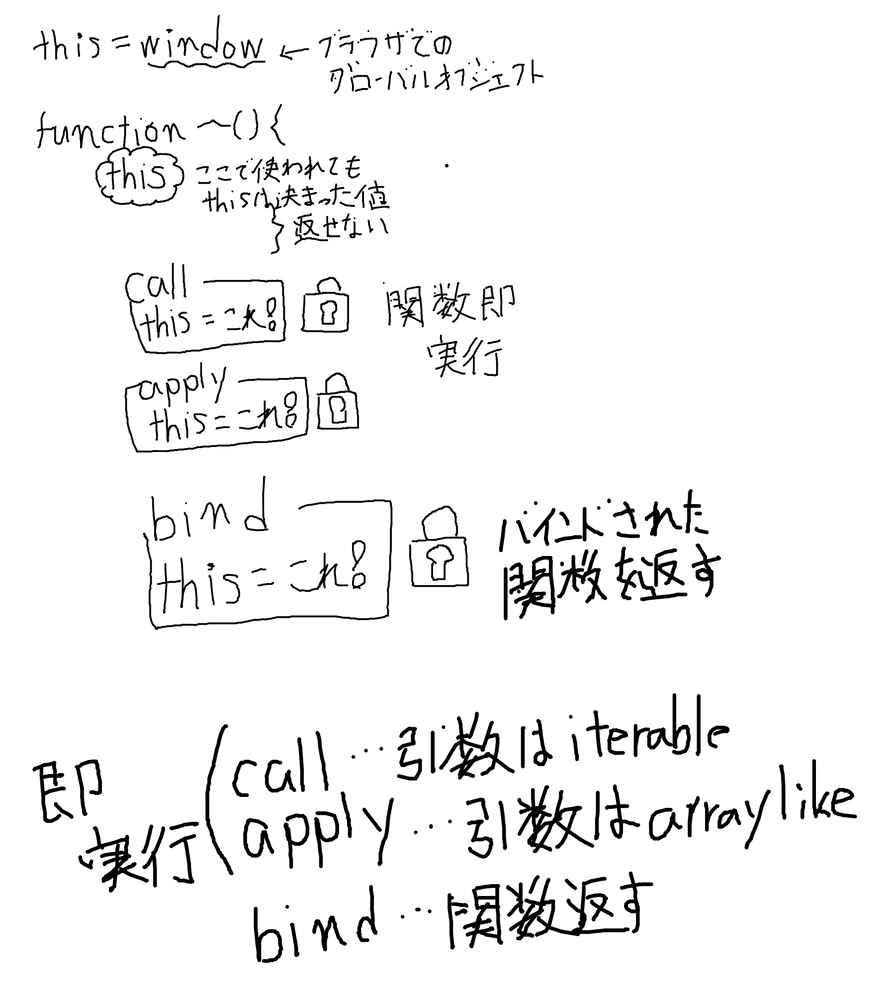

# Call Apply Bind の違い(What is the difference between Call, Apply and Bind)

[https://github.com/sudheerj/javascript-interview-questions#what-is-the-difference-between-call-apply-and-bind](https://github.com/sudheerj/javascript-interview-questions#what-is-the-difference-between-call-apply-and-bind)

## this

オブジェクトにアクセスするためのキーワード。
実行された場所によって this の参照が変わるので、実行されるまで値を持たない。
アロー関数は this を持たないので、アロー関数が使われる前の層の this を this として扱う

## call apply bind

実行される場所でコロコロ変わる this を束縛するために、Function.prototype に生えているメソッドが

- Function.prototype.call()
- Function.prototype.apply()
- Function.prototype.bind()

## call

this の値を束縛し、関数に渡す引き数を渡した上でその関数を実行する。

```js
function sayHello() {
  return `Hello ${this.name}`;
}

console.log(sayHello.call({ name: "John" }));
// Hello John
```

第 2 引数以降には、関数の引数となる iterable な値を渡す

```js
function sayHello(myName) {
  return `Hello ${this.name}. I'm ${myName}`;
}

console.log(sayHello.call({ name: "John" }, "Mike"));
// Hello John. I'm Mike
```

## apply

call と同じく this の値を束縛し、関数に渡す引き数を渡した上でその関数を実行する。

```js
function sayHello() {
  return `Hello ${this.name}`;
}

console.log(sayHello.apply({ name: "John" }));
// Hello John
```

第 2 引数以降には、関数の引数となる array like な値を渡す

```js
function sayHello(myName) {
  return `Hello ${this.name}. I'm ${myName}`;
}

console.log(sayHello.call({ name: "John" }, ["Mike"]));
// Hello John. I'm Mike
```

たぶん call よりも apply のほうが JS エンジンの最適化が効いて高速。

## bind

call と apply と同じく this の値を束縛するが、すぐに実行されない。

```js
function sayHello() {
  return `Hello ${this.name}`;
}

const binded = sayHello.bind({ name: "John" });

console.log(binded.sayHello());
// Hello John
```

```js
function sayHello() {
  return `Hello ${this.name}`;
}

const binded = sayHello.bind({ name: "John" });
console.log(binded("Mike"));
// Hello John. I'm Mike
```

bind すると、それは関数ではなく`exotic object`という関数ライクなものになり、関数として利用できる。



### 参考

- [デコレータと転送, call/apply](https://ja.javascript.info/call-apply-decorators)
- [関数バインディング](https://ja.javascript.info/bind)

<Code name="call-apply-bind-jr29v" />
