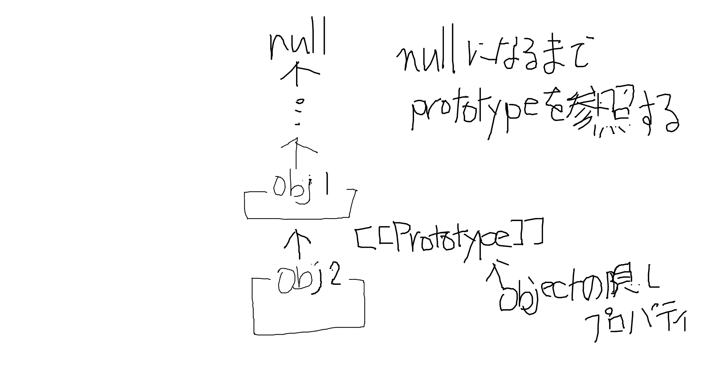

# prototype-chain(What is a prototype chain)

[https://github.com/sudheerj/javascript-interview-questions#what-is-a-prototype-chain](https://github.com/sudheerj/javascript-interview-questions#what-is-a-prototype-chain)

JS はプロトタイプベースの言語であり、オブジェクト指向に応用できる。
全てのオブジェクトは`prototype`オブジェクトを含んでおり、ここを経由してメソッドやプロパティを継承する。

```js
const base = {
  name: "John",
};
const object = Object.create(base);
console.log(Object.getPrototypeOf(object));
```

というように prototype の値を見ることもできる。
また、非推奨ではあるが、

```js
const base = {
  name: "John",
};
const object = Object.create(base);

console.log(object.__proto__);
```

`__proto__`でも見ることができる。

prototype オブジェクトは自身が生成（コンストラクタ）された元（プロトタイプ）への参照のリンクを張っていて、それをたどってメソッドやプロパティを継承する。
このことをプロトタイプチェーンと呼ぶ。



なお、プロパティが直接指定されたり削除されている場合はプロトタイプの走査は実行されない。
ビルトインオブジェクトの prototype を拡張するのは悪手で、それを継承した全てのオブジェクトで使うことができてしまうことになってしまい、散らかってしまう。決して行うべきではない。

<Code name="prototype-chain-q5p5z" />
